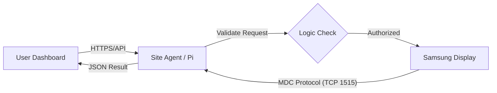

# Samsung Display Hub - Combined Project Guide

This file combines all project markdown documentation into one place.


---

## Source: README.md


# Samsung TV Control (Render + Vercel)

## Project structure

- `backend/` -> FastAPI service for Samsung MDC commands
- `frontend/` -> Vue + Vite app with ON/OFF buttons

## Backend (Render)

### Files included

- `backend/main.py`
- `backend/requirements.txt`
- `backend/.env.example`

### Render setup

1. Create a **Web Service** from your GitHub repo.
2. Root directory: `backend`
3. Build command:

   ```bash
   pip install -r requirements.txt
   ```

4. Start command:

   ```bash
   uvicorn main:app --host 0.0.0.0 --port $PORT
   ```

5. Add environment variables:
   - `FRONTEND_ORIGINS=https://samsung-display-hub.vercel.app,https://www.samsung-display-hub.vercel.app,http://localhost:5173,http://127.0.0.1:5173`
   - `REMOTE_AUTH_REQUIRED=true`
   - `CLOUD_API_KEY=your-long-random-secret-1`
   - `AGENT_SHARED_SECRET=your-long-random-secret-2`
   - `CONNECTION_TEST_TIMEOUT_SECONDS=8`

## Frontend (Vercel)

### Files included

- `frontend/package.json`
- `frontend/src/App.vue`
- `frontend/.env.example`

### Vercel setup

1. Create a new project from your GitHub repo.
2. Set project root to `frontend`.
3. Add environment variable:
   - `VITE_API_URL=https://your-backend.onrender.com`
   - `VITE_CLOUD_API_KEY=your-long-random-secret-1`
   - `VITE_DEFAULT_TV_IP=192.168.1.122`
   - `VITE_DEFAULT_DISPLAY_ID=1`
   - `VITE_DEFAULT_PORT=1515`
   - `VITE_DEFAULT_PROTOCOL=SIGNAGE_MDC`

Vercel auto-detects Vite and deploys it.

## Production for private LAN screens (recommended)

If your screens are in a private network (for example `192.168.x.x`), use:

- Backend on Raspberry Pi in the same LAN as screens
- Public frontend on Vercel
- Tailscale Funnel on Pi to expose backend over HTTPS

Full step-by-step guide:

- `backend/PI_TAILSCALE_VERCEL_SETUP.md`
- `backend/PI_SERVER_SETUP_AUTOSTART.md`

For multi-Pi routing, use the same identifier per site for:

- Pi hostname
- Tailscale device name
- `AGENT_ID` used in backend/frontend

## Quick production checks

- Render backend health: `https://samsung-display-hub.onrender.com/health`
- Render MDC catalog: `https://samsung-display-hub.onrender.com/api/mdc/commands`
- Vercel frontend: `https://samsung-display-hub.vercel.app`

Quick API check:

```bash
curl https://samsung-display-hub.onrender.com/health
```

- `backend/OPTION_B_SETUP.md` (cloud broker + Pi agents)
- `backend/RENDER_SETUP.md` (deploy backend on Render)
- `docs/MULTI_SITE_AGENT_ROUTING.md` (how Agent ID routes commands to the correct Pi)
- `docs/devices-multi-site-template.csv` (ready CSV import template for multi-site screens)

For multiple locations/Pis, see the **Multi-location setup** section in:

- `backend/PI_SERVER_SETUP_AUTOSTART.md`

## Local run

### Backend

```bash
cd backend
pip install -r requirements.txt
uvicorn main:app --reload --host 0.0.0.0 --port 8000
```

### Frontend

```bash
cd frontend
npm install
npm run dev
```


---

## Source: DEPLOY_REMINDER.md


# Deploy Reminder

When URLs are ready, set these values:

- Render backend env:
  - `FRONTEND_ORIGINS=https://<your-vercel-domain>.vercel.app`
- Vercel frontend env:
  - `VITE_API_URL=https://<your-render-service>.onrender.com`

Current repo:
- `https://github.com/Emilian-Ene/Samsung-Display-Hub.git`

Next step when URLs are available:
1. Send both URLs.
2. Update env vars in Render + Vercel.
3. Trigger redeploy.


---

## Source: LOGIC_NOTES.md


# SamsungBeta Logic Notes (MDC Only)

This project is intentionally focused on Samsung MDC control only.

## Architecture

- Frontend: Vue app in `frontend/src/App.vue`
- Backend: FastAPI API in `backend/main.py`
- Protocols: `SIGNAGE_MDC` and `AUTO` (AUTO resolves to `SIGNAGE_MDC`)

## Core flows

1. **Test connection**
   - Frontend calls `GET /api/test/{ip}`
   - Backend runs `mdc.status(display_id)` with timeout

2. **Power on/off**
   - Frontend calls `GET /api/tv/{ip}/{on|off}`
   - Backend sends MDC `power` command

3. **MDC CLI command**
   - Frontend calls `POST /api/mdc/execute`
   - Backend validates command and runs GET/SET/auto operation

4. **Detect connection**
   - Frontend calls `GET /api/probe/{ip}`
   - Backend probes MDC port (1515) and verifies status call

## Remote agent mode

- Frontend can enqueue remote jobs to cloud backend.
- Pi agent polls jobs and executes local MDC endpoints.
- Supported job kinds: `tv`, `test`, `probe`, `mdc_execute`, `local_http`.

## Device normalization

- Stored devices are normalized on load.
- Unknown protocols are converted to `AUTO`.
- Legacy non-MDC ports `8001`/`8002` are remapped to `1515` when protocol resolves to MDC.

## Key files

- `backend/main.py`
- `backend/option_b_agent.py`
- `frontend/src/App.vue`
- `README.md`


---

## Source: docs/Samsung_Control_System_Brief.md


# Samsung Remote Control System

## Technical Overview & Security Brief

**Date:** February 27, 2026  
**To:** Peter and Team  
**From:** Ionut

---

### 1. System Overview

We have developed a lightweight, web-based control dashboard that allows operations teams to remotely manage Samsung Commercial Displays over the local network (LAN).

- **Purpose:** To centralized management of screens (power, inputs, reboots), reducing the need for physical site visits.
- **Real-time Feedback:** Unlike IR remotes, this application reads status back from the screen (via Samsung MDC protocol), confirming if a command succeeded.
- **Automation:** Ensures consistent configuration (e.g., volume limits, weekly maintenance schedules) across the fleet.

### 2. System Logic & Data Flow



- **User Dashboard:** Operators interact only with the web UI; they never connect directly to the screen IPs.
- **Site Controller:** Acts as a secure proxy. It validates the request (IP, Command, Range) before sending it to the display.
- **Samsung Display:** Receives commands on the local LAN via the proprietary MDC protocol (TCP 1515).

### 3. Key Capabilities & Commands

The system translates operator actions into raw hex commands for the displays:

- **Power Control:** soft-reboot or wake-on-lan to manage energy and uptime.
- **Input Switching:** Instantly change sources (HDMI1 &harr; DisplayPort &harr; MagicInfo).
- **Volume & Mute:** Set absolute volume levels (0-100) or immediate mute.
- **Weekly Restart:** Program the screen's internal firmware to auto-reboot (e.g., _Fri 03:00 AM_) to prevent memory leaks and performance checking.
- **Security Lock:** Disable physical IR sensors and panel buttons to prevent on-site tampering.
- **Diagnostics:** Read current temperature, model info, and connection status.

### 4. Application Security Controls

The application is designed with "Secure by Design" principles for the control layer:

- **Strict Input Validation:** The backend rigorously checks all parameters. Malformed or out-of-range commands are rejected instantly, preventing "fuzzing" or buffer overflow attempts on the displays.
- **Service Isolation:** The application runs as a restricted `systemd` service user, not root. If compromised, it has no administrative access to the underlying OS.
- **Operational Logging:** Every command execution is logged (Timestamp, User IP, Target, Result), providing a permanent audit trail.
- **Network Privacy:** The application binds only to the internal network interface. It relies on the infrastructure VPN/Tunnel for access and exposes no ports to the public internet.

### 5. Risks & Mitigation Strategies (Application Scope)

| Risk Area                    | App/Backend Mitigation                                                                                                                                 |
| :--------------------------- | :----------------------------------------------------------------------------------------------------------------------------------------------------- |
| **Unauthorized Access**      | Dashboard must be protected by strong, unique credentials. API endpoints require valid session tokens (if MFA is enforced at identity provider level). |
| **Supply Chain**             | The "Auto-Update" feature pulls strictly from the approved Git repository. Branch rules protect the `main` branch from unauthorized code pushes.       |
| **Software Vulnerabilities** | Regular quarterly patching of the Python runtime and dependencies (FastAPI, System libraries) is required.                                             |
| **Abuse / DoS**              | Rate limiting and connection timeouts are configured in the backend to prevent command flooding.                                                       |

---

_Note: This brief covers application and method-of-operation security. Network-level security (Firewalls, VLAN segmentation, VPN access) is assumed to be managed by the infrastructure team._


---

## Source: docs/MULTI_SITE_AGENT_ROUTING.md


# Multi-site routing (many Pis, many screens)

This explains how commands are routed to the correct Raspberry Pi when you have multiple sites.

## Core rule

Each screen must have an `agentId` saved in the app.

- Each Pi runs `option_b_agent.py` with one unique `AGENT_ID`.
- The frontend sends remote jobs with `agent_id` = that screen `agentId`.
- Cloud backend queues by `agent_id`.
- Only the Pi with matching `AGENT_ID` polls and executes that job locally.

## Recommended naming scheme

Use stable IDs per site:

- `site-bucharest`
- `site-london`
- `site-berlin`

Avoid spaces and special characters.

## Example with 3 sites x 10 screens

- Pi at Bucharest hostname: `site-bucharest` (leave `AGENT_ID` empty or set `AGENT_ID=$(hostname)`)
- Pi at London hostname: `site-london` (leave `AGENT_ID` empty or set `AGENT_ID=$(hostname)`)
- Pi at Berlin hostname: `site-berlin` (leave `AGENT_ID` empty or set `AGENT_ID=$(hostname)`)

For every Bucharest screen, set `agentId=site-bucharest` in the dashboard.
For every London screen, set `agentId=site-london`.
For every Berlin screen, set `agentId=site-berlin`.

Then routing is automatic.

## Required CSV headers for import

Use these exact headers (case-insensitive):

`name,ip,port,displayId,protocol,agentId,site,city,zone,area,description`

Notes:

- `ip` is required.
- `displayId` defaults to `0` if empty.
- `port` defaults to `1515` if empty.
- `protocol` defaults to `AUTO` if empty.

## Quick verification checklist

1. On each Pi, confirm unique `AGENT_ID`.
2. In dashboard, confirm each screen has the correct `agentId`.
3. In cloud backend, verify heartbeat shows all agents: `GET /api/remote/agents`.
4. Test one screen per site.
5. Run "Refresh all".

## Common mistakes

- Same `AGENT_ID` used on 2 different Pis.
- Wrong `agentId` assigned to screens in CSV.
- Empty `agentId` for remote-only sites.
- Using local screen IPs from the wrong LAN/site.


---

## Source: backend/OPTION_B_SETUP.md


# Option B Setup (Cloud Broker + Local Pi Agent)

This setup lets your public app send commands to TVs that stay in private LANs.

## Architecture

- Cloud backend hosts queue endpoints.
- Each location runs one Pi **agent**.
- Agent polls cloud, executes jobs locally against `http://127.0.0.1:8000`, sends result back.

## 1) Cloud backend configuration

Deploy `backend/main.py` to your cloud backend (Render/Railway/etc), then set env:

- `FRONTEND_ORIGINS=https://samsung-display-hub.vercel.app,https://www.samsung-display-hub.vercel.app,http://localhost:5173,http://127.0.0.1:5173`
- `REMOTE_AUTH_REQUIRED=true`
- `CLOUD_API_KEY=your-long-random-secret-1`
- `AGENT_SHARED_SECRET=your-long-random-secret-2`
- `CONNECTION_TEST_TIMEOUT_SECONDS=8`

Use real strong random values in production, and keep `AGENT_SHARED_SECRET` identical on cloud and all Pi agents.

Start command:

```bash
uvicorn main:app --host 0.0.0.0 --port $PORT
```

## 2) Pi local backend (per location)

Run the existing local backend on each Pi (same LAN as TVs):

```bash
cd backend
pip install -r requirements.txt
uvicorn main:app --host 0.0.0.0 --port 8000
```

## 3) Pi agent (per location)

On each Pi, set env and run agent:

```bash
cd backend
export CLOUD_BASE_URL=https://your-cloud-backend.example.com
# Optional override. If not set, agent uses Pi hostname.
export AGENT_ID=$(hostname)
export AGENT_SHARED_SECRET=<same-value-as-cloud>
export LOCAL_BACKEND_URL=http://127.0.0.1:8000
python option_b_agent.py
```

If `AGENT_ID` is unset, the agent automatically uses the Pi hostname.

Recommended naming rule (important):

- `AGENT_ID` = Pi hostname = Tailscale device name
- Keep the same exact value in all three places for each Pi

Example for one site:

- Pi hostname: `site-bucharest`
- Tailscale device name: `site-bucharest`
- `AGENT_ID=$(hostname)` (or leave empty and auto-use hostname)

For reboot persistence on Pi, use systemd setup from:

- `backend/PI_SERVER_SETUP_AUTOSTART.md` (section: Option B agent auto start)
- `backend/systemd/samsung-option-b-agent.service`
- `backend/systemd/samsung-option-b-agent.env.example`

To prevent Pi idle/sleep behavior and Wi-Fi auto power-save (recommended for stable polling), run once on each Pi:

```bash
sudo systemctl mask sleep.target suspend.target hibernate.target hybrid-sleep.target
sudo iw dev wlan0 set power_save off
sudo mkdir -p /etc/NetworkManager/conf.d
printf "[connection]\nwifi.powersave=2\n" | sudo tee /etc/NetworkManager/conf.d/wifi-powersave.conf >/dev/null
sudo systemctl restart NetworkManager
```

## Frontend configuration for Option B

In Vercel (or local `frontend/.env`), set:

- `VITE_API_URL=https://your-cloud-backend.example.com`
- `VITE_CLOUD_API_KEY=<same CLOUD_API_KEY from cloud backend>`

In the dashboard UI, set **Agent ID** on each device to match the Pi agent (`AGENT_ID`) at that location.

This value should also match that Pi hostname/Tailscale name to avoid routing confusion.

## 4) Enqueue a job from frontend or script

### Turn TV on (via a specific site agent)

```bash
curl -X POST "https://your-cloud-backend.example.com/api/remote/jobs" \
  -H "Content-Type: application/json" \
  -H "x-api-key: <CLOUD_API_KEY>" \
  -d '{
    "agent_id": "site-bucharest",
    "kind": "tv",
    "payload": {
      "ip": "192.168.1.122",
      "command": "on",
      "display_id": 0,
      "port": 1515,
      "protocol": "SIGNAGE_MDC"
    }
  }'
```

### Check job status

```bash
curl "https://your-cloud-backend.example.com/api/remote/jobs/<job_id>" \
  -H "x-api-key: <CLOUD_API_KEY>"
```

### List agents

```bash
curl "https://your-cloud-backend.example.com/api/remote/agents" \
  -H "x-api-key: <CLOUD_API_KEY>"
```

## Supported job kinds

- `tv` -> local `GET /api/tv/{ip}/{on|off}`
- `test` -> local `GET /api/test/{ip}`
- `probe` -> local `GET /api/probe/{ip}`
- `mdc_execute` -> local `POST /api/mdc/execute`
- `local_http` -> advanced passthrough local HTTP request

## Important MVP notes

- Queue is currently in-memory in cloud backend. Restarting cloud backend clears queued history.
- For production durability, move jobs/agents to Redis or Postgres.
- Keep `CLOUD_API_KEY` and `AGENT_SHARED_SECRET` private.


---

## Source: backend/RENDER_SETUP.md


# Render Setup (Backend)

Use this when you want the backend cloud-hosted on Render.

## Deploy from GitHub

1. Push your repo to GitHub.
2. In Render, create a **Blueprint** (recommended) or **Web Service**.
3. If using Blueprint, select this repo and Render will read `render.yaml`.
4. If using Web Service manually:
   - Root Directory: `backend`
   - Build Command: `pip install -r requirements.txt`
   - Start Command: `uvicorn main:app --host 0.0.0.0 --port $PORT`

## Required environment variables

Set these in Render service settings:

- `FRONTEND_ORIGINS=https://samsung-display-hub.vercel.app,https://www.samsung-display-hub.vercel.app,http://localhost:5173,http://127.0.0.1:5173`
- `REMOTE_AUTH_REQUIRED=true`
- `CLOUD_API_KEY=your-long-random-secret-1`
- `AGENT_SHARED_SECRET=your-long-random-secret-2`
- `CONNECTION_TEST_TIMEOUT_SECONDS=8`

Use real strong random values in production, and keep `AGENT_SHARED_SECRET` identical on cloud and all Pi agents.

## Frontend (Vercel) values

Set in Vercel:

- `VITE_API_URL=https://your-render-service.onrender.com`
- `VITE_CLOUD_API_KEY=your-long-random-secret-1`

## Pi agent values (each location)

Run one agent per site with unique ID:

- `CLOUD_BASE_URL=https://your-render-service.onrender.com`
- `AGENT_ID=$(hostname)` (or leave unset to auto-use Pi hostname)
- `AGENT_SHARED_SECRET=<same as Render>`
- `LOCAL_BACKEND_URL=http://127.0.0.1:8000`

Start agent:

```bash
cd backend
python option_b_agent.py
```

For auto-start on reboot, use:

- `backend/PI_SERVER_SETUP_AUTOSTART.md` (Option B agent auto start section)
- `backend/systemd/samsung-option-b-agent.service`
- `backend/systemd/samsung-option-b-agent.env.example`

## Smoke test

1. Check Render health:

```bash
curl https://your-render-service.onrender.com/health
```

2. Verify agent heartbeat appears:

```bash
curl https://your-render-service.onrender.com/api/remote/agents \
  -H "x-api-key: <CLOUD_API_KEY>"
```

3. Queue a power ON job:

```bash
curl -X POST https://your-render-service.onrender.com/api/remote/jobs \
  -H "Content-Type: application/json" \
  -H "x-api-key: <CLOUD_API_KEY>" \
  -d '{
    "agent_id": "site-bucharest",
    "kind": "tv",
    "payload": {
      "ip": "192.168.1.122",
      "command": "on",
      "display_id": 0,
      "port": 1515,
      "protocol": "SIGNAGE_MDC"
    }
  }'
```


---

## Source: backend/PI_TAILSCALE_VERCEL_SETUP.md


# Pi Backend + Tailscale Funnel + Vercel Frontend (Production)

This setup lets your public Vercel website control Samsung screens in a private LAN.

## Architecture

- Screens: private LAN (example `192.168.1.x`)
- Backend: Raspberry Pi in same LAN as screens
- Public frontend: Vercel
- Public backend URL: Tailscale Funnel on Pi (HTTPS)

Vercel calls Pi backend over HTTPS, Pi controls screens locally.

## Fixed values for your project

- GitHub repo: `https://github.com/Emilian-Ene/Samsung-Display-Hub.git`
- Frontend domain: `https://samsung-display-hub.vercel.app`
- Cloud backend (Option B): `https://samsung-display-hub.onrender.com`
- Local backend port on Pi: `8000`
- MDC device port: `1515`

If you use Option B agent routing for multiple Pis:

- Set one unique name per Pi and reuse it everywhere:
  - Pi hostname
  - Tailscale device name
  - `AGENT_ID`
- Example: `site-bucharest`

---

## 0) Full copy-paste bootstrap on a new Pi

```bash
sudo apt update && sudo apt upgrade -y
sudo apt install -y git curl python3 python3-venv python3-pip
curl -fsSL https://tailscale.com/install.sh | sh
sudo tailscale up

cd /home/pi
git clone https://github.com/Emilian-Ene/Samsung-Display-Hub.git
cd /home/pi/Samsung-Display-Hub/backend

python3 -m venv .venv
source .venv/bin/activate
pip install --upgrade pip
pip install -r requirements.txt

export FRONTEND_ORIGINS="https://samsung-display-hub.vercel.app,http://localhost:5173"
python -m uvicorn main:app --host 0.0.0.0 --port 8000
```

Health check (new terminal):

```bash
curl http://127.0.0.1:8000/health
```

---

## 1) On Raspberry Pi: run backend

```bash
cd /home/pi/Samsung-Display-Hub/backend
python3 -m venv .venv
source .venv/bin/activate
pip install -r requirements.txt
```

Set CORS (replace with your real Vercel domain):

```bash
export FRONTEND_ORIGINS="https://samsung-display-hub.vercel.app,http://localhost:5173"
```

Start backend:

```bash
python -m uvicorn main:app --host 0.0.0.0 --port 8000
```

Health check from Pi:

```bash
curl http://127.0.0.1:8000/health
```

---

## 2) Expose backend publicly with Tailscale Funnel

On Pi (same shell or another shell):

```bash
sudo tailscale funnel --bg 8000
```

Read your exact Funnel URL:

```bash
tailscale funnel status
```

Copy the `https://...ts.net` URL and use it as `VITE_API_URL` in Vercel.

Check from any internet-connected device:

```bash
curl https://<your-funnel-url>/health
```

---

## 3) Configure Vercel env vars

In Vercel project settings -> Environment Variables:

- `VITE_API_URL=https://<your-funnel-url>`
- `VITE_DEFAULT_TV_IP=192.168.1.122`
- `VITE_DEFAULT_DISPLAY_ID=1`
- `VITE_DEFAULT_PORT=1515`
- `VITE_DEFAULT_PROTOCOL=SIGNAGE_MDC`

Redeploy after saving env vars.

Quick reminder for your existing cloud setup:

- If you want to keep using Render directly (without Funnel), current value is:
  - `VITE_API_URL=https://samsung-display-hub.onrender.com`

---

## 4) In app device list

Keep real screen LAN IPs/ports:

- IP: `192.168.1.xxx`
- Port: `1515` (MDC)
- Protocol: `AUTO` or `SIGNAGE_MDC`

The Pi can reach these private IPs because it is inside the same LAN.

---

## 5) Important notes

- Render backend alone cannot directly control private LAN screens.
- Tailscale Funnel must remain active on Pi.
- Keep Pi powered on and connected to LAN/Tailscale.
- `FRONTEND_ORIGINS` must include your Vercel domain.

### Prevent Pi sleep and Wi-Fi auto power-save (recommended)

Run once on the Pi:

```bash
sudo systemctl mask sleep.target suspend.target hibernate.target hybrid-sleep.target
sudo iw dev wlan0 set power_save off
sudo mkdir -p /etc/NetworkManager/conf.d
printf "[connection]\nwifi.powersave=2\n" | sudo tee /etc/NetworkManager/conf.d/wifi-powersave.conf >/dev/null
sudo systemctl restart NetworkManager
```

If your Pi uses `dhcpcd`, also add:

```bash
echo "interface wlan0\n  wireless_power_save off" | sudo tee -a /etc/dhcpcd.conf
sudo systemctl restart dhcpcd
```

Quick checks:

```bash
iw dev wlan0 get power_save
systemctl is-enabled sleep.target suspend.target hibernate.target hybrid-sleep.target
```

---

## 6) Testing links (exact URLs)

### Render backend

- Health: `https://samsung-display-hub.onrender.com/health`
- MDC commands catalog: `https://samsung-display-hub.onrender.com/api/mdc/commands`

Quick test:

```bash
curl https://samsung-display-hub.onrender.com/health
```

Expected:

```json
{ "status": "ok" }
```

### Vercel frontend

- App URL: `https://samsung-display-hub.vercel.app`

Open in browser and confirm:

- Page loads
- Devices dashboard visible
- Logs panel visible

### Pi Funnel backend

- Health: `https://<your-funnel-url>/health`
- MDC commands catalog: `https://<your-funnel-url>/api/mdc/commands`

Quick test:

```bash
curl https://<your-funnel-url>/health
```

Expected:

```json
{ "status": "ok" }
```

---

## Optional: auto start backend on Pi (systemd)

Example service file `/etc/systemd/system/samsung-backend.service`:

```ini
[Unit]
Description=Samsung Display Hub Backend
After=network-online.target

[Service]
User=pi
WorkingDirectory=/home/pi/Samsung-Display-Hub/backend
Environment=FRONTEND_ORIGINS=https://samsung-display-hub.vercel.app,http://localhost:5173
ExecStart=/home/pi/Samsung-Display-Hub/backend/.venv/bin/python -m uvicorn main:app --host 0.0.0.0 --port 8000
Restart=always
RestartSec=3

[Install]
WantedBy=multi-user.target
```

Enable + start:

```bash
sudo systemctl daemon-reload
sudo systemctl enable samsung-backend
sudo systemctl start samsung-backend
sudo systemctl status samsung-backend
```


---

## Source: backend/PI_SERVER_SETUP_AUTOSTART.md


# Raspberry Pi Backend Setup (Start + Auto Start)

This guide sets up the backend on a Raspberry Pi from scratch and enables automatic start after reboot.

## 1) Install prerequisites

```bash
sudo apt update
sudo apt install -y python3 python3-pip python3-venv git
```

## 2) Download project

```bash
cd ~
git clone https://github.com/Emilian-Ene/Samsung-Display-Hub.git
cd ~/Samsung-Display-Hub/backend
```

## 3) Create virtual environment and install dependencies

```bash
python3 -m venv .venv
source .venv/bin/activate
pip install --upgrade pip
pip install -r requirements.txt
```

## 4) Run backend manually (first test)

Set frontend origins (current domain is `https://samsung-display-hub.vercel.app`; change only if your domain changes):

```bash
export FRONTEND_ORIGINS="https://samsung-display-hub.vercel.app,http://localhost:5173"
```

Start backend:

```bash
python -m uvicorn main:app --host 0.0.0.0 --port 8000
```

Health check in another terminal:

```bash
curl http://127.0.0.1:8000/health
```

Expected:

```json
{ "status": "ok" }
```

Stop manual run with `Ctrl+C` after test.

---

## 5) Enable auto start with systemd

Find your Pi username:

```bash
whoami
```

Username is `paragon-av`.

Create service file:

```bash
sudo nano /etc/systemd/system/samsung-backend.service
```

Paste:

```ini
[Unit]
Description=Samsung Display Hub Backend
After=network-online.target
Wants=network-online.target

[Service]
User=paragon-av
WorkingDirectory=/home/paragon-av/Samsung-Display-Hub/backend
Environment=FRONTEND_ORIGINS=https://samsung-display-hub.vercel.app,http://localhost:5173
ExecStart=/home/paragon-av/Samsung-Display-Hub/backend/.venv/bin/python -m uvicorn main:app --host 0.0.0.0 --port 8000
Restart=always
RestartSec=3

[Install]
WantedBy=multi-user.target
```

Save in nano:

- `Ctrl+O`, `Enter`, `Ctrl+X`

Enable and start:

```bash
sudo systemctl daemon-reload
sudo systemctl enable samsung-backend
sudo systemctl start samsung-backend
```

Check status:

```bash
sudo systemctl status samsung-backend
```

Health check again:

```bash
curl http://127.0.0.1:8000/health
```

---

## 6) Useful commands

Restart service:

```bash
sudo systemctl restart samsung-backend
```

View logs:

```bash
sudo journalctl -u samsung-backend -f
```

Stop service:

```bash
sudo systemctl stop samsung-backend
```

Disable auto start:

```bash
sudo systemctl disable samsung-backend
```

---

## 7) Common errors

### `status=217/USER`

`User=` in service file is wrong. Set it to your real username from `whoami`.

### `No such file or directory` for `ExecStart`

Path to `.venv` or project folder is wrong. Verify:

```bash
ls -la /home/paragon-av/Samsung-Display-Hub/backend/.venv/bin/python
```

### `API URL Missing` in frontend

Set Vercel env var:

- `VITE_API_URL=https://paragon.taila5270a.ts.net`

---

## 8) Multi-location setup (multiple Raspberry Pis)

If you have multiple sites, each site needs its own Pi backend URL.

Provide this mapping for each location:

- `location_name` -> `pi_backend_url`

Example:

- `Bucharest` -> `https://pi-buc-xxxx.ts.net`
- `Cluj` -> `https://pi-clj-xxxx.ts.net`
- `Iasi` -> `https://pi-ias-xxxx.ts.net`

Use the same location value format as your device records (`city` or `site`).
This allows frontend routing to send each screen command to the correct Pi backend.

---

## 9) Option B agent auto start (systemd)

Use this if backend is hosted on Render (or any cloud) and each Pi runs local agent.

Create environment file:

```bash
sudo nano /etc/samsung-option-b-agent.env
```

Paste values (edit for your deployment):

```dotenv
CLOUD_BASE_URL=https://your-render-service.onrender.com
# Optional override. If empty, agent uses Pi hostname.
AGENT_ID=
AGENT_SHARED_SECRET=replace-with-strong-random-secret
LOCAL_BACKEND_URL=http://127.0.0.1:8000
AGENT_POLL_INTERVAL_SECONDS=2
AGENT_MAX_JOBS_PER_POLL=5
AGENT_REQUEST_TIMEOUT_SECONDS=20
```

Protect file permissions:

```bash
sudo chmod 600 /etc/samsung-option-b-agent.env
```

Create service file:

```bash
sudo nano /etc/systemd/system/samsung-option-b-agent.service
```

Paste:

```ini
[Unit]
Description=Samsung Display Hub Option B Agent
After=network-online.target samsung-backend.service
Wants=network-online.target

[Service]
Type=simple
User=paragon-av
WorkingDirectory=/home/paragon-av/Samsung-Display-Hub/backend
EnvironmentFile=/etc/samsung-option-b-agent.env
ExecStart=/home/paragon-av/Samsung-Display-Hub/backend/.venv/bin/python /home/paragon-av/Samsung-Display-Hub/backend/option_b_agent.py
Restart=always
RestartSec=3

[Install]
WantedBy=multi-user.target
```

Enable and start:

```bash
sudo systemctl daemon-reload
sudo systemctl enable samsung-option-b-agent
sudo systemctl start samsung-option-b-agent
```

Check status/logs:

```bash
sudo systemctl status samsung-option-b-agent
sudo journalctl -u samsung-option-b-agent -f
```

Restart later:

```bash
sudo systemctl restart samsung-option-b-agent
```

Repo templates are available here:

- `backend/systemd/samsung-option-b-agent.service`
- `backend/systemd/samsung-option-b-agent.env.example`

---

## 10) Optional auto update from Git (every 5 minutes)

If you want Pi to auto-pull latest `main` and restart services automatically:

Install script:

```bash
sudo cp /home/paragon-av/Samsung-Display-Hub/backend/systemd/samsung-auto-update.sh /usr/local/bin/samsung-auto-update.sh
sudo sed -i 's/\r$//' /usr/local/bin/samsung-auto-update.sh
sudo chmod +x /usr/local/bin/samsung-auto-update.sh
bash -n /usr/local/bin/samsung-auto-update.sh
```

Install service + timer:

```bash
sudo cp /home/paragon-av/Samsung-Display-Hub/backend/systemd/samsung-auto-update.service /etc/systemd/system/samsung-auto-update.service
sudo cp /home/paragon-av/Samsung-Display-Hub/backend/systemd/samsung-auto-update.timer /etc/systemd/system/samsung-auto-update.timer
sudo systemctl daemon-reload
sudo systemctl enable --now samsung-auto-update.timer
```

Check timer status:

```bash
systemctl status samsung-auto-update.timer --no-pager
systemctl list-timers --all | grep samsung-auto-update
```

Run one manual update now:

```bash
sudo systemctl start samsung-auto-update.service
sudo journalctl -u samsung-auto-update.service -n 50 --no-pager
```

Stop/disable later:

```bash
sudo systemctl disable --now samsung-auto-update.timer
```


---

## Source: backend/autoupdatebackend.md


# Auto Update Backend From Git (Next Pi)

Use this on a new Pi to auto-update backend code from `origin/main`.

## 1) Install auto-update script + timer

```bash
cd /home/paragon-av/Samsung-Display-Hub
git fetch origin && git reset --hard origin/main

sudo cp ./backend/systemd/samsung-auto-update.sh /usr/local/bin/samsung-auto-update.sh
sudo sed -i 's/\r$//' /usr/local/bin/samsung-auto-update.sh
sudo chmod +x /usr/local/bin/samsung-auto-update.sh
bash -n /usr/local/bin/samsung-auto-update.sh

sudo cp ./backend/systemd/samsung-auto-update.service /etc/systemd/system/
sudo cp ./backend/systemd/samsung-auto-update.timer /etc/systemd/system/

sudo systemctl daemon-reload
sudo systemctl enable --now samsung-auto-update.timer
```

## 2) Verify timer is active

```bash
systemctl status samsung-auto-update.timer --no-pager
systemctl list-timers --all | grep samsung-auto-update
```

You should see the next run in about 5 minutes.

## 3) Run one update now (no wait)

```bash
sudo systemctl start samsung-auto-update.service
sudo journalctl -u samsung-auto-update.service -n 50 --no-pager
```

## 4) Watch updates live

```bash
sudo journalctl -u samsung-auto-update.service -f
```

## What this does

- Checks Git `origin/main` every 5 minutes
- Pulls updates only when commit changed
- Restarts `samsung-backend`
- Restarts `samsung-option-b-agent` if installed

## Disable later

```bash
sudo systemctl disable --now samsung-auto-update.timer
```
