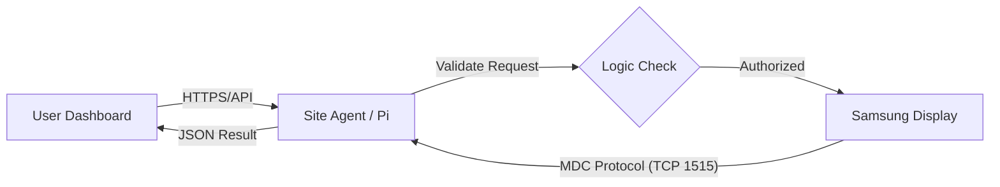

# Samsung Remote Control System

## Technical Overview & Security Brief

**Date:** February 27, 2026  
**To:** Peter and Team  
**From:** Ionut

---

### 1. System Overview

We have developed a lightweight, web-based control dashboard that allows operations teams to remotely manage Samsung Commercial Displays over the local network (LAN).

- **Purpose:** To centralized management of screens (power, inputs, reboots), reducing the need for physical site visits.
- **Real-time Feedback:** Unlike IR remotes, this application reads status back from the screen (via Samsung MDC protocol), confirming if a command succeeded.
- **Automation:** Ensures consistent configuration (e.g., volume limits, weekly maintenance schedules) across the fleet.

### 2. System Logic & Data Flow

- **User Dashboard:** Operators interact only with the web UI; they never connect directly to the screen IPs.
- **Site Controller:** Acts as a secure proxy. It validates the request (IP, Command, Range) before sending it to the display.
- **Samsung Display:** Receives commands on the local LAN via the proprietary MDC protocol (TCP 1515).

### 3. Key Capabilities & Commands

The system translates operator actions into raw hex commands for the displays:

- **Power Control:** soft-reboot or wake-on-lan to manage energy and uptime.
- **Input Switching:** Instantly change sources (HDMI1 &harr; DisplayPort &harr; MagicInfo).
- **Volume & Mute:** Set absolute volume levels (0-100) or immediate mute.
- **Weekly Restart:** Program the screen's internal firmware to auto-reboot (e.g., _Fri 03:00 AM_) to prevent memory leaks and performance checking.
- **Security Lock:** Disable physical IR sensors and panel buttons to prevent on-site tampering.
- **Diagnostics:** Read current temperature, model info, and connection status.

### 4. Application Security Controls

The application is designed with "Secure by Design" principles for the control layer:

- **Strict Input Validation:** The backend rigorously checks all parameters. Malformed or out-of-range commands are rejected instantly, preventing "fuzzing" or buffer overflow attempts on the displays.
- **Service Isolation:** The application runs as a restricted `systemd` service user, not root. If compromised, it has no administrative access to the underlying OS.
- **Operational Logging:** Every command execution is logged (Timestamp, User IP, Target, Result), providing a permanent audit trail.
- **Network Privacy:** The application binds only to the internal network interface. It relies on the infrastructure VPN/Tunnel for access and exposes no ports to the public internet.

### 5. Risks & Mitigation Strategies (Application Scope)

| Risk Area                    | App/Backend Mitigation                                                                                                                                 |
| :--------------------------- | :----------------------------------------------------------------------------------------------------------------------------------------------------- |
| **Unauthorized Access**      | Dashboard must be protected by strong, unique credentials. API endpoints require valid session tokens (if MFA is enforced at identity provider level). |
| **Supply Chain**             | The "Auto-Update" feature pulls strictly from the approved Git repository. Branch rules protect the `main` branch from unauthorized code pushes.       |
| **Software Vulnerabilities** | Regular quarterly patching of the Python runtime and dependencies (FastAPI, System libraries) is required.                                             |
| **Abuse / DoS**              | Rate limiting and connection timeouts are configured in the backend to prevent command flooding.                                                       |

---

_Note: This brief covers application and method-of-operation security. Network-level security (Firewalls, VLAN segmentation, VPN access) is assumed to be managed by the infrastructure team._
